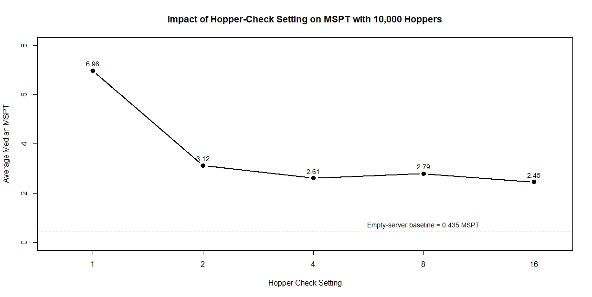

# Hopper Check Tick Lag Test

## Why I Tested This

The server I normally play on has `hopper-check` set to 8 to reduce lag.

The downside is that this can interfere with multi-item sorters and other more complicated redstone machines that rely on hoppers checking for items more often.

So I wanted to find out whether we could lower `hopper-check` without bringing back most of the hopper lag.

Basically, I hosted a creative Minecraft server, measured its normal performance, then loaded 10,000 unlocked hoppers and tested `hopper-check` at 1, 2, 4, 8, and 16.

A tick is basically one update of the Minecraft server. Minecraft normally runs at 20 ticks per second, so `hopper-check = 1` means a hopper checks every tick, while `hopper-check = 8` means it checks once every 8 ticks.

## Want the super dumbed-down version?

If you just want the simple explanation without all the technical stuff, read the [super dumbed-down README](SUPER-DUMBED-DOWN-README.md).

## What I Found

The biggest improvement happened when changing `hopper-check` from 1 to 2.

Going from 1 to 2 reduced average median MSPT by about 55%.

After that, the performance improvements became much smaller. HC4, HC8, and HC16 all ended up in roughly the same range.

My takeaway is that `hopper-check = 2` looks like a good compromise for this kind of setup. It keeps hopper behavior much closer to vanilla while still getting most of the performance improvement.

Basically: setting it to 8 does reduce lag, but these tests suggest you may not need to go that high.

Testing how Paper's `hopper-check` setting affects server MSPT and hopper-related tick lag using 10,000 loaded hoppers.

## Test Setup

- Paper test server version 26.1.2
- 10,000 loaded hoppers
- 289 loaded chunks
- 1 player
- `hopper-transfer = 8`
- Each test ran for about 60 seconds
- MSPT measured with Spark
- Two runs were performed for each hopper-check setting

## Results

| Hopper Check | Average Median MSPT | Reduction vs HC1 |
|---|---:|---:|
| 1 | 6.9785 | 0% |
| 2 | 3.1158 | 55.35% |
| 4 | 2.6059 | 62.66% |
| 8 | 2.7903 | 60.02% |
| 16 | 2.4507 | 64.88% |

## Benchmark Graph

**Empty-server baseline:** 0.435 MSPT

## Main Finding

The largest improvement occurred when `hopper-check` was increased from 1 to 2.

HC2 reduced average median MSPT by about 55% compared with HC1.

Increasing `hopper-check` beyond 4 produced much smaller improvements, with HC4, HC8, and HC16 all testing in roughly the same performance range.

This suggests strong diminishing returns after approximately HC2-HC4.

## Notes

The test used two runs per setting, so the data should be treated as a small controlled benchmark rather than a definitive performance study.

HC1 showed substantially more run-to-run variation than the higher hopper-check settings.

Because the benchmark was performed on a controlled test server, the exact MSPT improvement on a production server will depend on factors such as loaded chunks, hopper count, entities, plugins, and other tick activity.

Raw Spark profiler files from the individual test runs are included in the repository for reference.

## Raw Profiles

Raw Spark profiler files for each benchmark run are available in the [`spark-profiles`](spark-profiles/) folder.

## Viewing the Spark Profiles

The raw `.sparkprofile` files are meant to be opened with the Spark web viewer.

Download one of the `.sparkprofile` files from the `spark-profiles` folder, then upload it to the Spark profiler viewer to see the full interactive report.

Spark profiler viewer:
https://spark.lucko.me/
